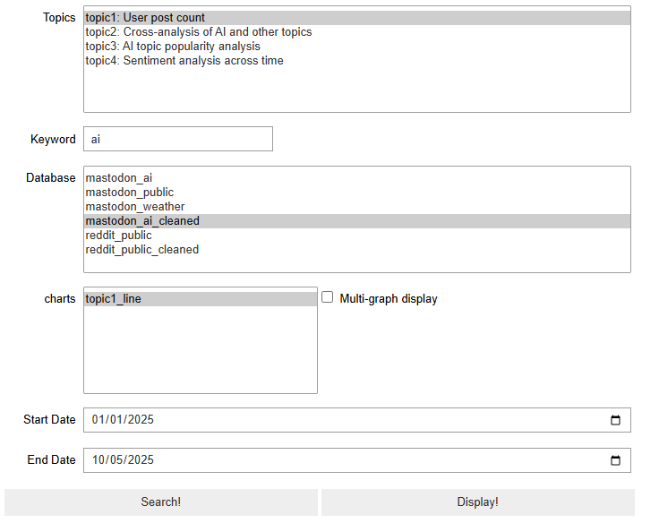
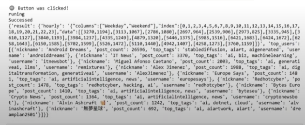

# COMP90024_team_17

## project introduction
This project aims to analyze multi-dimensional data related to Australia AI on the Mastodon platform in recent years, including but not limited to:
- sentiment analysis
- Hot topic analysis
- Tag distribution analysis
- Top N users analysis
We crawl Mastodon post regularly and store in Elasticsearch, and then perform visualization and report generation to help understand the development trajectory of AI topics in the Australian community.

##  Repository Structure

```plaintext
├── backend/                         # backend files
│   ├── data_analyse/ 
│   │      ├── Dockerfile
│   │      ├── dispatch.py   
│   │      ├── emotion.py    
│   │      ├── hotTopic.py 
│   │      ├── requirements.txt
│   │      ├── tag.py     
│   │      └── topn.py
│   ├──data_cleaning/
│   │        ├──elasticsearch_cleaning_pipeline.json
│   │        ├──elasticsearch_reddit_clean.json  
│   │        └──readme.md       
│   ├── fission/
│   │        ├──function/
│   │                ├──mastodon_ai/  # sourcecode of mastodon AI data collector 
│   │                │       ├── build.sh
│   │                │       ├── mastodon_ai.py
│   │                │       └── requirement.txt
│   │                ├──mastodon_public/ # sourcecode of mastodon public data collector
│   │                └──reddit_public/ # sourcecode of reddit public data collector
│   ├──deployment.yaml
│   └──service.yaml
├── database/
│       └──elasticsearch_index_mapping/ #include elasticsearch index mapping prompts
├── frontend/
│        ├── deployment.ymal
│        ├── Dockerfile
│        ├── front-end-function.ipynb
│        ├── README.md
│        ├── requirements.txt
│        └── service.yaml
├── test/
│     ├── test_elasticsearch_upload.py  
│     └── test_mastodon_fetch.py      
├── docs/ # report
└── README.md                      # Gitlab structure description

```
##  How to Install

NeCTAR account resigtion, VM application, Cluster and Elastic Search Database set up procedures are same as [Guide](https://gitlab.unimelb.edu.au/feit-comp90024/comp90024/). 

### Backend Programs Install
<details>
  <summary>Backend  Programs Install</summary>
  Here is the code for install backend programs.

  ```shell
  $ cd ~/comp90024_team_17/backend/data_analyse
  # Build the image and upload to your container warehouse.
  # In our project we use this gitlab as warehouse, here is the commands of how to authentify and upload.
  $ docker login registry.gitlab.unimelb.edu.au:5005
  $ docker build -t registry.gitlab.unimelb.edu.au:5005/yutazhou/comp90024_team_17:latest .
  $ docker push registry.gitlab.unimelb.edu.au:5005/yutazhou/comp90024_team_17:latest
  # Create the namespace call backend and the image pull secret.
  # Image pull secret allows deployment.yaml to access to the warehouse and get the image. So it includes your username and access token.
  # To the directory which contain the deployment.yaml and service.yaml
  $ cd ~/comp90024_team_17/backend
  $ kubectl apply -f deployment.yaml
  $ kubectl apply -f service.yaml
  # Now the backend programs successfully deployed and runing on the pods.
  $ kubectl get pods -n backend
  # Watch the running logs of the pod.
  $ kubectl logs -n backend <pods_name> -f
  ```
</details>

### Frontend Program Install
<details>
  <summary>Frontend Program Install</summary>
  Here is the code for install frontend program.

  ```shell
  $ cd ~/comp90024_team_17/frontend
  # Build the image and upload to your container warehouse.
  # In our project we use this gitlab as warehouse, here is the commands of how to authentify and upload.
  $ docker login registry.gitlab.unimelb.edu.au:5005
  $ docker build -t registry.gitlab.unimelb.edu.au:5005/yutazhou/comp90024_team_17:frontend .
  $ docker push registry.gitlab.unimelb.edu.au:5005/yutazhou/comp90024_team_17:frontend
  # Create the namespace call frontend and the image pull secret.
  # Image pull secret allows deployment.yaml to access to the warehouse and get the image. So it includes your username and access token.
  $ kubectl apply -f deployment.yaml
  $ kubectl apply -f service.yaml
  # Now the frontend programs successfully deployed and runing on the pods.
  $ kubectl get pods -n frontend
  ```
</details>

### Runing the Frontend Program
The frontend program is the main entry of our project, as we open the jupyter notebook, we can access the backend, and backend can connect to the Elastic Search for data.
<details>
  <summary>Frontend Program Running</summary>
  Here is the code for running frontend program.

  ```shell
  # Port-forward so that your local device can access to the frontend program. For Windows user and using ubuntu in WSL2 to connect the cluster.
  $ kubectl port-forward deployment-86f5554cb-c797l 8888:8888 -n frontend
  ```
</details>
Open the http://localhost:8888/ on your browser that can access to the Jupyter Notebook, and open the front-end-function.ipynb that can access to the frontend program. And click the "run all cell" button can activate the it, and the UI is at the bottom of the notebook. Your don't need further modification to the code, unless you know what you are doing.

For more immersive experience, I suggest to turn on the "hide input all" and "table of contents(2)" extentions in the Nbextentions module in the notebook.



Your can select the topics, keyword(for some of the topics this is not avaliable), database, charts and date information. We have bind the default combination to each topic, once you select different topic, our UI will automatically select the suitable database and others for you. Of course you can change those by selecting your own interest on the UI.





Once clicked the "Search!" button, front-end program will send those information shown in the UI toward the backend programs. The backend programs will connect to Elastic Search for accessing data. After the results are returned from the backend, you will see some results are printed below the UI, like the image shown. Then you can click the 
"Display!" button to plot the selected chart. You can also adjust the date picker to focus the line graph on a specific time period.

